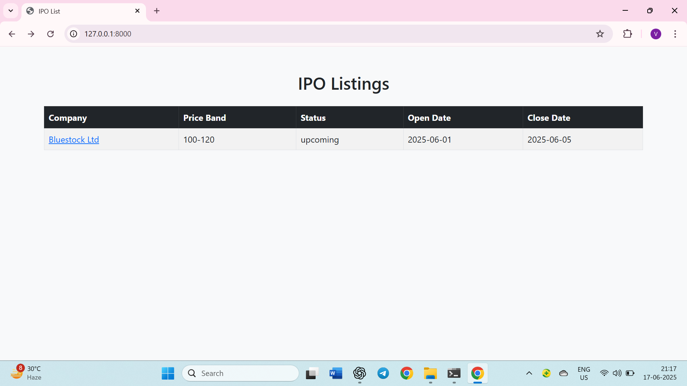
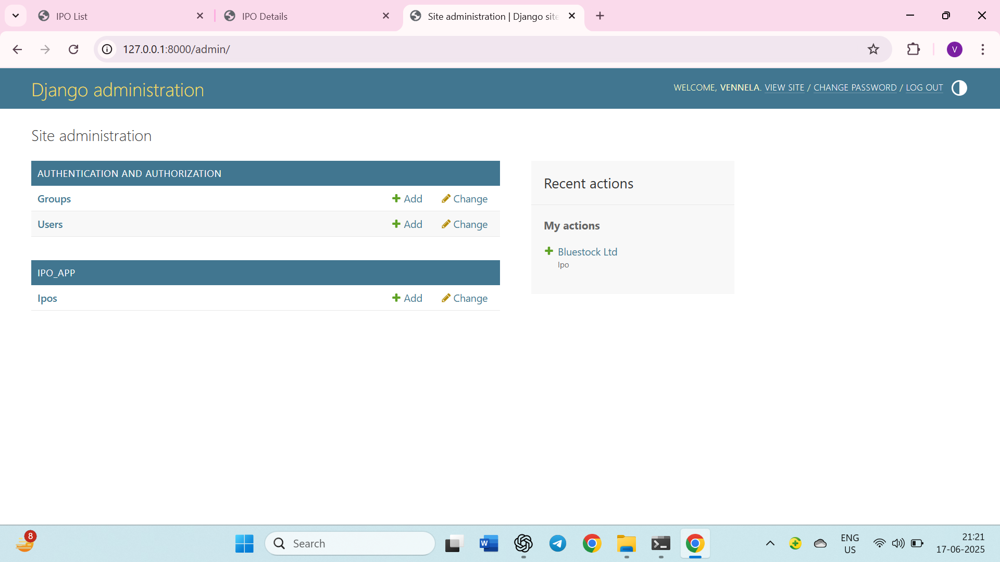

# IPO Web App – Bluestock Internship Project

A full-stack IPO Management Web Application built as an individual assignment during my internship at Bluestock Fintech.  
It allows users to view upcoming IPOs, track IPO details, and visualize key price comparisons.

## Features

- List of all IPOs (Home Page)
- Detailed view for each IPO (company info, dates, prices)
- Interactive bar chart comparing:
  - IPO Price
  - Listing Price
  - Current Market Price
- Admin panel to manage IPO records
- Upload company logos and PDF files (RHP/DRHP)
- REST API endpoints using Django REST Framework
- Bootstrap-based frontend with JavaScript fetch API

## Tech Stack

| Layer      | Technology               |
|------------|--------------------------|
| Backend    | Python, Django           |
| API        | Django REST Framework    |
| Frontend   | HTML, CSS, Bootstrap     |
| Database   | SQLite (dev), PostgreSQL |
| Charting   | Chart.js                 |
| Admin      | Django Admin Panel       |

## API Endpoints (Examples)

- `GET /api/ipo/` – List all IPOs  
- `GET /api/ipo/<id>/` – View IPO detail  
- `POST /api/ipo/` – Add new IPO  
- `PUT/PATCH/DELETE` – Update or delete IPO

## Screenshots

### Home Page – IPO Listings



### Detail Page – IPO Info and Chart


### Admin Panel – Add/Edit IPO



Note: Place screenshots in a folder named `screenshots/` inside your project directory.

## How to Run Locally

```bash
git clone https://github.com/your-username/ipo-web-app.git
cd ipo-web-app
python -m venv venv
venv\Scripts\activate
pip install -r requirements.txt
python manage.py migrate
python manage.py runserver
